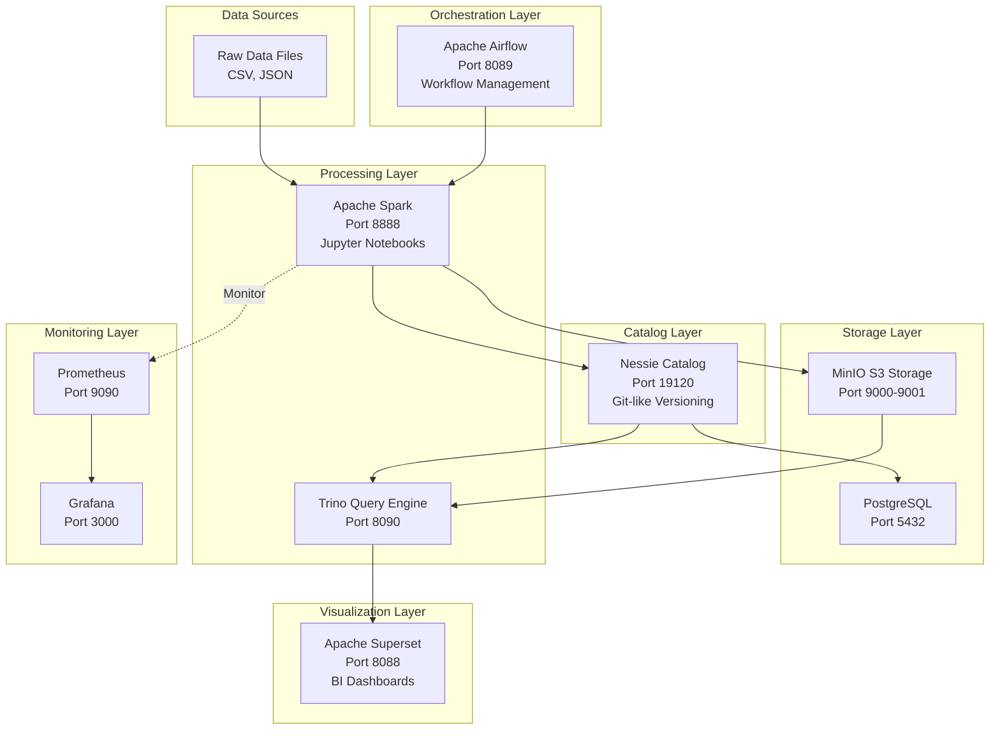
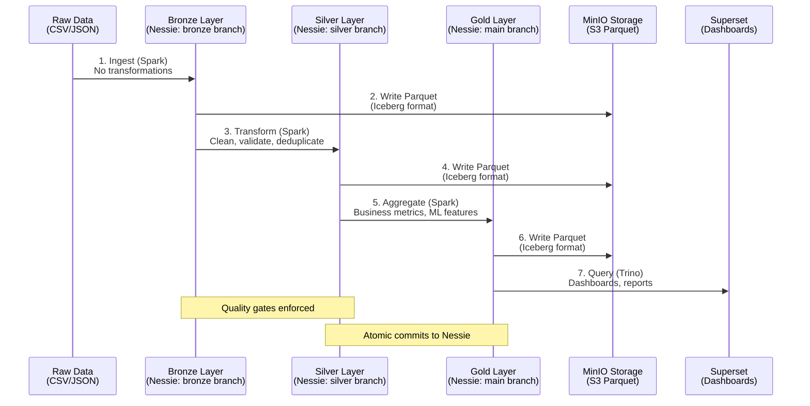

# Version Control For Databases - Complete Project Overview

> **Last Updated**: January 29, 2026  
> **Status**: Production Ready ✅  
> **Project Type**: Modern Data Lakehouse with Git-like Version Control

---

## 🎯 Project Vision & Purpose

This project implements a **Modern Data Lakehouse Architecture** with **Git-like version control for data**, built on the **Medallion Architecture** pattern (Bronze → Silver → Gold → Platinum layers). It enables data engineers to manage data transformations with the same branching, merging, and rollback capabilities found in software version control systems.

### Core Innovation
- **Version Control for Data**: Use branches (bronze, silver, gold) to isolate data at different stages
- **ACID Transactions**: Ensure data consistency across distributed storage
- **Time Travel**: Query historical versions of data
- **Schema Evolution**: Handle schema changes without breaking downstream pipelines
- **Quality Gates**: Validate data quality at each layer before promotion

---

## 🏗️ High-Level Architecture



---

## 📦 Complete Tech Stack & Port Mapping

### Core Infrastructure Services

| Service | Port(s) | Container Name | Role | Status |
|---------|---------|---------------|------|--------|
| **MinIO** | 9000 (API)<br/>9001 (Console) | `lakehouse-minio` | S3-compatible object storage | Core |
| **PostgreSQL** | 5432 | `lakehouse-postgres` | Nessie metadata persistence | Core |
| **Nessie** | 19120 | `lakehouse-nessie` | Git-like data catalog | Core |
| **Spark Notebook** | 8888 | `lakehouse-spark` | Data processing & Jupyter | Core |

### Extended Services

| Service | Port(s) | Container Name | Role | Status |
|---------|---------|---------------|------|--------|
| **Trino** | 8090 | `lakehouse-trino` | Distributed SQL query engine | Optional |
| **Airflow Web** | 8089 | `lakehouse-airflow` | Workflow UI | Optional |
| **Airflow Scheduler** | N/A | `lakehouse-airflow-scheduler` | DAG scheduler | Optional |
| **Superset** | 8088 | `superset_app` | Business intelligence dashboard | Optional |
| **Superset DB** | 5432 (internal) | `superset_db` | Superset metadata | Optional |
| **Prometheus** | 9090 | `monitoring-prometheus` | Metrics collection | Optional |
| **Grafana** | 3000 | `monitoring-grafana` | Metrics visualization | Optional |
| **Node Exporter** | 9100 | `monitoring-node-exporter` | System metrics | Optional |

---

## 🔧 Technology Stack Deep Dive

### 1. **Apache Spark** (Data Processing Engine)

**What is it?**  
Apache Spark is a unified analytics engine for large-scale data processing. It provides high-level APIs in Java, Scala, Python, and R, and an optimized engine that supports general execution graphs.

**Role in This Project:**
- **Primary Processing Engine**: Executes all data transformations (Bronze → Silver → Gold → Platinum)
- **Iceberg Integration**: Writes data in Apache Iceberg format for ACID compliance
- **Nessie Integration**: Commits data to specific branches (bronze, silver, gold)
- **Interactive Analysis**: Provides Jupyter notebook interface at port 8888
- **Distributed Computing**: Can scale to multiple worker nodes

**Key Configurations:**
- **Image**: `alexmerced/spark33-notebook` (Spark 3.3 with Jupyter)
- **Memory**: 4GB driver, 8GB executor (production)
- **Master Port**: 7077 (for worker connectivity)
- **UI Port**: 4040 (Spark application UI)
- **Packages Used**:
  - `iceberg-spark-runtime-3.3_2.12:1.3.1` - Iceberg table format
  - `nessie-spark-extensions-3.3_2.12:0.67.0` - Nessie catalog integration
  - `aws-java-sdk-bundle` - S3 connectivity

**What Runs Here:**
- Bronze layer ingestion scripts (`ingest_*.py`)
- Silver layer transformation scripts (`transform_*.py`)
- Gold layer aggregation scripts (`aggregate_*.py`)
- Platinum layer ML pipelines (`churn_prediction.py`, `clv_prediction.py`)
- Interactive Jupyter notebooks for data exploration

---

### 2. **Nessie** (Git-Like Data Catalog)

**What is it?**  
Nessie is a transactional catalog for data lakes that provides Git-like version control semantics for data. It supports branches, tags, merges, and atomic commits.

**Role in This Project:**
- **Data Version Control**: Manages multiple isolated branches (bronze, silver, gold, main)
- **Catalog Management**: Tracks metadata for all Iceberg tables
- **ACID Guarantees**: Ensures atomic commits across multiple tables
- **Time Travel**: Enables querying historical data states
- **Branch Isolation**: Allows development/testing without affecting production

**Key Configurations:**
- **Version Store**: JDBC (PostgreSQL) for persistence
- **API Endpoint**: `http://localhost:19120/api/v1`
- **Branches Created**:
  - `bronze` - Raw ingested data
  - `silver` - Cleaned and validated data
  - `gold` - Business-ready aggregations (merged to `main`)
  - `main` - Production branch

**API Operations:**
```bash
# List all branches
curl http://localhost:19120/api/v1/trees

# View branch contents
curl http://localhost:19120/api/v1/trees/tree/bronze/entries

# Create new branch
curl -X POST http://localhost:19120/api/v1/trees/branch/new-feature \
  -H "Content-Type: application/json" \
  -d '{"name":"new-feature","hash":"main"}'
```

**What This Enables:**
- Isolated data environments per pipeline stage
- Rollback capabilities if transformations fail
- A/B testing of data transformations
- Experimental feature development without risk

---

### 3. **Apache Iceberg** (Table Format)

**What is it?**  
Apache Iceberg is an open table format for huge analytic datasets. It brings the reliability and simplicity of SQL tables to big data, providing features like ACID transactions, schema evolution, and hidden partitioning.

**Role in This Project:**
- **ACID Transactions**: Ensures data consistency during writes
- **Schema Evolution**: Add/remove/rename columns without rewriting data
- **Time Travel**: Query historical snapshots of tables
- **Partition Evolution**: Change partitioning scheme without rewriting
- **Hidden Partitioning**: Users don't need to know partition columns

**Key Features Used:**
- **Snapshot Isolation**: Each read sees a consistent snapshot
- **MERGE Operations**: Upsert capabilities for incremental updates
- **Metadata Management**: Efficient metadata operations (no full table scans)
- **Columnar Storage**: Data stored in Parquet format

**Table Structure:**
```
s3a://lakehouse/warehouse/
├── ecommerce/
│   ├── customers_bronze/
│   │   ├── metadata/
│   │   │   ├── v1.metadata.json
│   │   │   ├── v2.metadata.json
│   │   ├── data/
│   │   │   ├── partition1.parquet
│   │   │   ├── partition2.parquet
│   ├── orders_silver/
│   ├── customer_summary/
```

---

### 4. **MinIO** (S3-Compatible Storage)

**What is it?**  
MinIO is a high-performance, S3-compatible object storage system. It's designed for large-scale private cloud infrastructure.

**Role in This Project:**
- **Data Storage**: Stores all Iceberg table data in Parquet format
- **S3 Compatibility**: Uses S3A filesystem for Spark connectivity
- **Bucket Management**: Hosts `lakehouse` bucket for all data
- **Local Development**: Replaces AWS S3 for cost-free local testing

**Key Configurations:**
- **API Port**: 9000 - S3-compatible API
- **Console Port**: 9001 - Web UI for bucket management
- **Credentials**: `admin` / `password123` (development)
- **Endpoint**: `http://minio:9000` (internal), `http://localhost:9000` (external)

**Console Access:**
1. Navigate to `http://localhost:9001`
2. Login with credentials
3. Browse `lakehouse/warehouse/ecommerce/` to see data files

**Production Alternative:**
- **Oracle Object Storage**: Used in production deployment
- **Configuration**: See `docker-compose-production.yml`

---

### 5. **PostgreSQL** (Metadata Database)

**What is it?**  
PostgreSQL is a powerful, open-source object-relational database system with a strong reputation for reliability, feature robustness, and performance.

**Role in This Project:**
- **Nessie Persistence**: Stores Nessie catalog metadata (branches, commits, refs)
- **Airflow Metadata**: Stores Airflow DAG runs, task states (production)
- **Superset Metadata**: Stores Superset dashboards, datasets, users

**Key Configurations:**
- **Port**: 5432 (internal to Docker network)
- **Database Names**:
  - `metastore` - Nessie catalog
  - `superset` - Superset metadata
- **Credentials**: `admin` / `password123` (development)

**Schema**:
- Nessie stores commit log, branch references, tag references
- Survives container restarts (data persisted in `nessie-db` volume)

**Production Alternative:**
- **Supabase PostgreSQL**: Managed PostgreSQL in production
- **SSL Required**: Production uses SSL connections

---

### 6. **Apache Trino** (Distributed SQL Query Engine)

**What is it?**  
Trino (formerly PrestoSQL) is a distributed SQL query engine designed to query large data sets distributed over one or more heterogeneous data sources.

**Role in This Project:**
- **Fast Analytics**: Query Iceberg tables without Spark overhead
- **Multi-Catalog Queries**: Join data across different sources
- **BI Tool Integration**: Connect to Superset, Tableau, etc.
- **Production Queries**: Low-latency queries for dashboards

**Key Configurations:**
- **Port**: 8090 (HTTP API and UI)
- **Catalogs**: Configured to connect to Nessie + MinIO
- **Config Location**: `./trino/etc/`

**Example Query:**
```sql
-- Query from Trino CLI
SELECT 
  customer_tier,
  COUNT(*) as customer_count,
  SUM(total_spent) as total_revenue
FROM iceberg.ecommerce.customer_summary
GROUP BY customer_tier
ORDER BY total_revenue DESC;
```

---

### 7. **Apache Airflow** (Workflow Orchestration)

**What is it?**  
Apache Airflow is a platform to programmatically author, schedule, and monitor workflows. It uses Directed Acyclic Graphs (DAGs) to define dependencies.

**Role in This Project:**
- **Pipeline Orchestration**: Schedule and run medallion pipeline (Bronze → Silver → Gold)
- **Dependency Management**: Ensure tasks run in correct order
- **Monitoring**: Track pipeline success/failure
- **Retries**: Automatically retry failed tasks

**Key Configurations:**
- **Web UI**: Port 8089
- **Executor**: LocalExecutor (single machine)
- **DAG Location**: `./airflow/dags/`
- **Credentials**: `admin` / `admin`

**DAG Example:**
```python
# medallion_pipeline.py
from airflow import DAG
from airflow.operators.bash import BashOperator

dag = DAG('medallion_pipeline', schedule_interval='@daily')

bronze_task = BashOperator(
    task_id='ingest_bronze',
    bash_command='docker exec lakehouse-spark python3 /home/jovyan/scripts/bronze/ingest_full_dataset.py',
    dag=dag
)

silver_task = BashOperator(
    task_id='transform_silver',
    bash_command='docker exec lakehouse-spark python3 /home/jovyan/scripts/silver/merge_silver.py',
    dag=dag
)

bronze_task >> silver_task  # bronze must finish before silver
```

**Access Airflow:**
1. Navigate to `http://localhost:8089`
2. Login: `admin` / `admin`
3. Enable/trigger DAGs from UI

---

### 8. **Apache Superset** (Business Intelligence)

**What is it?**  
Apache Superset is a modern, enterprise-ready business intelligence web application. It's fast, lightweight, and intuitive.

**Role in This Project:**
- **Data Visualization**: Create charts and dashboards
- **SQL Lab**: Interactive SQL editor for ad-hoc queries
- **Dashboard Sharing**: Share insights with business stakeholders
- **Trino Integration**: Connect to Trino for fast queries

**Key Configurations:**
- **Port**: 8088
- **Database**: PostgreSQL (superset_db)
- **Build**: Custom Dockerfile with Trino connector
- **Credentials**: Set during first login

**Supported Chart Types:**
- Time-series line charts
- Bar/pie charts
- Geospatial maps
- Pivot tables
- Custom visualizations

**Connection String (Trino):**
```
trino://localhost:8090/iceberg/ecommerce
```

---

### 9. **Prometheus + Grafana** (Monitoring Stack)

**What is Prometheus?**  
Prometheus is an open-source monitoring and alerting toolkit. It scrapes metrics from instrumented jobs and stores them as time-series data.

**What is Grafana?**  
Grafana is an open-source analytics and monitoring platform. It allows you to query, visualize, alert on, and explore metrics.

**Role in This Project:**
- **Metrics Collection**: Prometheus scrapes JVM metrics from Spark, Nessie, Trino
- **System Monitoring**: Node Exporter collects CPU, memory, disk metrics
- **Alerting**: Send alerts when thresholds breached
- **Dashboards**: Grafana visualizes Prometheus metrics

**Key Configurations:**
- **Prometheus Port**: 9090
- **Grafana Port**: 3000
- **Grafana Credentials**: `admin` / `admin`
- **Prometheus Config**: `./docker/prometheus.yml`

**Metrics Tracked:**
- Spark executor/driver memory usage
- Nessie commit rate
- Query latency
- Disk I/O
- Network throughput

---

## 📊 Medallion Architecture (Data Pipeline Layers)

### Bronze Layer (Raw Ingestion)

**Purpose**: Ingest raw data without modification

**Branch**: `bronze`

**Scripts**:
- [`ingest_customers_spark.py`](file:///E:/Projects/Version_Control_For_Databases/scripts/bronze/ingest_customers_spark.py) - Ingest customer CSV
- [`ingest_orders_spark.py`](file:///E:/Projects/Version_Control_For_Databases/scripts/bronze/ingest_orders_spark.py) - Ingest orders CSV
- [`ingest_full_dataset.py`](file:///E:/Projects/Version_Control_For_Databases/scripts/bronze/ingest_full_dataset.py) - Bulk ingestion

**Tables Created**:
- `nessie.ecommerce.customers_bronze` - Raw customer data
- `nessie.ecommerce.orders_bronze` - Raw order data

**Characteristics**:
- No transformations applied
- Preserves source data exactly
- Append-only writes
- Used for data recovery and auditing

---

### Silver Layer (Cleaned & Validated)

**Purpose**: Clean, deduplicate, and validate data

**Branch**: `silver`

**Scripts**:
- [`transform_customers_silver.py`](file:///E:/Projects/Version_Control_For_Databases/scripts/silver/transform_customers_silver.py) - Email validation, standardization
- [`transform_orders_silver.py`](file:///E:/Projects/Version_Control_For_Databases/scripts/silver/transform_orders_silver.py) - Deduplication, quality scoring
- [`merge_silver.py`](file:///E:/Projects/Version_Control_For_Databases/scripts/silver/merge_silver.py) - Incremental updates
- [`audit_silver_quality.py`](file:///E:/Projects/Version_Control_For_Databases/scripts/silver/audit_silver_quality.py) - Quality checks

**Tables Created**:
- `nessie.ecommerce.customers_silver` - Validated customers
- `nessie.ecommerce.orders_silver` - Deduplicated orders

**Transformations Applied**:
- Email validation (regex check)
- Data standardization (uppercase names, consistent formats)
- Deduplication (remove exact duplicates)
- Quality scoring (0-100 score per record)
- NULL handling

**Quality Gates**:
- 100% email validity
- 0% duplicate records
- 95%+ quality score threshold

---

### Gold Layer (Business Aggregations)

**Purpose**: Create business-ready, aggregated datasets

**Branch**: `main` (gold tables merged to production)

**Scripts**:
- [`aggregate_customer_summary_gold.py`](file:///E:/Projects/Version_Control_For_Databases/scripts/gold/aggregate_customer_summary_gold.py) - Customer lifetime value
- [`customer_segmentation_iceberg.py`](file:///E:/Projects/Version_Control_For_Databases/scripts/gold/customer_segmentation_iceberg.py) - RFM segmentation
- [`product_recommendation_iceberg.py`](file:///E:/Projects/Version_Control_For_Databases/scripts/gold/product_recommendation_iceberg.py) - Collaborative filtering
- [`build_gold_layer.py`](file:///E:/Projects/Version_Control_For_Databases/scripts/gold/build_gold_layer.py) - Full gold build
- [`audit_gold_quality.py`](file:///E:/Projects/Version_Control_For_Databases/scripts/gold/audit_gold_quality.py) - Validation

**Tables Created**:
- `nessie.ecommerce.customer_summary` - Customer KPIs
- `nessie.ecommerce.customer_segments` - RFM segmentation
- `nessie.ecommerce.product_recommendations` - Recommendation scores

**Metrics Calculated**:
- Total revenue per customer
- Order count per customer
- Average order value
- Customer tier (Premium/Gold/Silver/Bronze)
- Recency, Frequency, Monetary scores
- Product affinity scores

---

### Platinum Layer (Machine Learning)

**Purpose**: Advanced analytics and predictive models

**Branch**: Feature branches (experimental)

**Scripts**:
- [`churn_prediction.py`](file:///E:/Projects/Version_Control_For_Databases/scripts/platinum/churn_prediction.py) - XGBoost churn model
- [`clv_prediction.py`](file:///E:/Projects/Version_Control_For_Databases/scripts/platinum/clv_prediction.py) - Customer lifetime value forecast
- [`next_purchase_prediction.py`](file:///E:/Projects/Version_Control_For_Databases/scripts/platinum/next_purchase_prediction.py) - Time-to-next-purchase

**Models Used**:
- **Churn Prediction**: XGBoost classifier
- **CLV Prediction**: Random Forest regressor
- **Segmentation**: K-Means clustering (scikit-learn)

**Features Engineered**:
- Recency (days since last order)
- Frequency (orders per month)
- Monetary (total spend)
- Seasonality indicators
- Product category preferences

---

## 🧪 Jupyter Notebooks

Located in [`./notebooks/`](file:///E:/Projects/Version_Control_For_Databases/notebooks)

| Notebook | Purpose |
|----------|---------|
| [`BRONZE_LAYER.ipynb`](file:///E:/Projects/Version_Control_For_Databases/notebooks/BRONZE_LAYER.ipynb) | Interactive bronze ingestion |
| [`SILVER_LAYER.ipynb`](file:///E:/Projects/Version_Control_For_Databases/notebooks/SILVER_LAYER.ipynb) | Interactive silver transformations |
| [`GOLD_LAYER.ipynb`](file:///E:/Projects/Version_Control_For_Databases/notebooks/GOLD_LAYER.ipynb) | Interactive gold aggregations |
| [`Query_Lakehouse.ipynb`](file:///E:/Projects/Version_Control_For_Databases/notebooks/Query_Lakehouse.ipynb) | Ad-hoc queries across all layers |
| [`Production_Query.ipynb`](file:///E:/Projects/Version_Control_For_Databases/notebooks/Production_Query.ipynb) | Production data analysis |

**Access**: Navigate to `http://localhost:8888`

---

## 🔄 Data Flow & Processing Pipeline



### Detailed Pipeline Steps

**Step 1: Raw Data Ingestion (Bronze)**
```bash
docker exec lakehouse-spark python3 /home/jovyan/scripts/bronze/ingest_orders_spark.py
```
- Reads raw CSV files from `./data/raw/`
- Writes to `nessie.ecommerce.orders_bronze` on `bronze` branch
- No schema validation (permissive mode)
- Preserves all source columns

**Step 2: Data Cleaning (Silver)**
```bash
docker exec lakehouse-spark python3 /home/jovyan/scripts/silver/transform_orders_silver.py
```
- Reads from `bronze` branch
- Applies transformations:
  - Remove duplicates
  - Validate email formats
  - Standardize string casing
  - Handle NULL values
  - Calculate quality scores
- Writes to `nessie.ecommerce.orders_silver` on `silver` branch
- Quality gate: 95% pass rate required

**Step 3: Business Aggregation (Gold)**
```bash
docker exec lakehouse-spark python3 /home/jovyan/scripts/gold/aggregate_customer_summary_gold.py
```
- Reads from `silver` branch
- Joins customers + orders
- Calculates metrics:
  - Total spent per customer
  - Order count
  - Average order value
  - Customer tier (based on spend)
- Writes to `nessie.ecommerce.customer_summary` on `main` branch

**Step 4: Visualization (Superset)**
- Trino queries `main` branch tables
- Superset creates dashboards
- Business users access via web UI

---

## 🌍 Environment Configurations

### Development Environment (Local)

**File**: [`docker-compose.yml`](file:///E:/Projects/Version_Control_For_Databases/docker-compose.yml)

**Services**:
- MinIO (local S3)
- PostgreSQL (local DB)
- Nessie
- Spark Notebook

**Use Case**: Local development, testing, experimentation

---

### Production Environment (Oracle Cloud)

**File**: [`docker-compose-production.yml`](file:///E:/Projects/Version_Control_For_Databases/docker-compose-production.yml)

**Changes**:
- MinIO → **Oracle Object Storage** (cloud S3)
- PostgreSQL → **Supabase PostgreSQL** (managed DB)
- Adds **Airflow** for orchestration
- Network mode: `host` (for multi-VM communication)

**Environment Variables** (`.env.prod`):
```bash
# Oracle Object Storage
ORACLE_ACCESS_KEY=your-key
ORACLE_SECRET_KEY=your-secret
ORACLE_REGION=us-ashburn-1
ORACLE_ENDPOINT=https://objectstorage.us-ashburn-1.oraclecloud.com
WAREHOUSE=oci://namespace/lakehouse-prod/warehouse

# Supabase PostgreSQL
SUPABASE_JDBC_URL=jdbc:postgresql://db.xxx.supabase.co:5432/postgres?sslmode=require
SUPABASE_PASSWORD=your-password
```

---

### Distributed Spark Cluster

**File**: [`docker-compose-spark.yml`](file:///E:/Projects/Version_Control_For_Databases/docker-compose-spark.yml)

**Services**:
- Spark Master (port 7077)
- Spark Workers (separate VMs, using [`docker-compose-vm2-worker.yml`](file:///E:/Projects/Version_Control_For_Databases/docker-compose-vm2-worker.yml))

**Use Case**: Large-scale data processing (100GB+ datasets)

---

### Optional Services

**Monitoring**: [`docker/docker-compose-monitoring.yml`](file:///E:/Projects/Version_Control_For_Databases/docker/docker-compose-monitoring.yml)
- Prometheus (metrics)
- Grafana (dashboards)
- Node Exporter (system metrics)

**Trino**: [`docker-compose-trino.yml`](file:///E:/Projects/Version_Control_For_Databases/docker-compose-trino.yml)
- Fast SQL queries
- BI tool integration

**Superset**: [`docker/docker-compose-superset.yml`](file:///E:/Projects/Version_Control_For_Databases/docker/docker-compose-superset.yml)
- Data visualization
- Dashboards

---

## 🚀 Quick Start Commands

### Start Core Services
```bash
# Clone repository
git clone https://github.com/Saadmomin2903/Version_Control_For_Databases.git
cd Version_Control_For_Databases

# Start core lakehouse
docker compose up -d

# Wait for services
sleep 40

# Create branches
python scripts/utils/create_nessie_branches.py
```

### Run Complete Pipeline
```bash
# Bronze ingestion
docker exec lakehouse-spark python3 /home/jovyan/scripts/bronze/ingest_full_dataset.py

# Silver transformation
docker exec lakehouse-spark python3 /home/jovyan/scripts/silver/merge_silver.py

# Gold aggregation
docker exec lakehouse-spark python3 /home/jovyan/scripts/gold/build_gold_layer.py
```

### Access Services
- **Jupyter**: http://localhost:8888
- **MinIO Console**: http://localhost:9001 (admin / password123)
- **Nessie API**: http://localhost:19120/api/v1/trees
- **Trino UI**: http://localhost:8090 (if running)
- **Airflow**: http://localhost:8089 (admin / admin, if running)
- **Superset**: http://localhost:8088 (if running)
- **Grafana**: http://localhost:3000 (admin / admin, if running)

---

## 📁 Project Directory Structure

```
Version_Control_For_Databases/
├── airflow/
│   └── dags/
│       └── medallion_pipeline.py         # Orchestration DAG
├── config/                               # Configuration files
├── data/
│   ├── raw/                              # Source CSV/JSON files
│   ├── bronze/                           # Bronze layer cache
│   ├── silver/                           # Silver layer cache
│   └── gold/                             # Gold layer cache
├── docker/
│   ├── docker-compose-monitoring.yml     # Prometheus + Grafana
│   ├── docker-compose-superset.yml       # Apache Superset
│   └── prometheus.yml                    # Prometheus config
├── docs/                                 # Documentation
├── notebooks/
│   ├── BRONZE_LAYER.ipynb                # Interactive bronze
│   ├── SILVER_LAYER.ipynb                # Interactive silver
│   ├── GOLD_LAYER.ipynb                  # Interactive gold
│   └── Query_Lakehouse.ipynb             # Ad-hoc queries
├── orchestration/
│   └── dags/                             # Additional DAGs
├── scripts/
│   ├── bronze/                           # Bronze ingestion scripts
│   │   ├── ingest_customers_spark.py
│   │   ├── ingest_orders_spark.py
│   │   └── ingest_full_dataset.py
│   ├── silver/                           # Silver transformation scripts
│   │   ├── transform_customers_silver.py
│   │   ├── transform_orders_silver.py
│   │   └── merge_silver.py
│   ├── gold/                             # Gold aggregation scripts
│   │   ├── aggregate_customer_summary_gold.py
│   │   ├── customer_segmentation_iceberg.py
│   │   └── product_recommendation_iceberg.py
│   ├── platinum/                         # ML model scripts
│   │   ├── churn_prediction.py
│   │   ├── clv_prediction.py
│   │   └── next_purchase_prediction.py
│   ├── utils/                            # Utility scripts
│   │   ├── create_nessie_branches.py
│   │   └── promote_to_production.py
│   ├── quality/                          # Data quality checks
│   └── recovery/                         # Recovery scripts
├── trino/
│   └── etc/                              # Trino configuration
├── docker-compose.yml                    # Core services (dev)
├── docker-compose-production.yml         # Production deployment
├── docker-compose-spark.yml              # Spark cluster
├── docker-compose-trino.yml              # Trino service
├── QUICKSTART.md                         # 5-minute setup guide
├── README.md                             # Project overview
└── requirements.txt                      # Python dependencies
```

---

## 🛠️ Utility Scripts

### Branch Management
- [`create_nessie_branches.py`](file:///E:/Projects/Version_Control_For_Databases/scripts/utils/create_nessie_branches.py) - Create bronze/silver/gold branches
- [`promote_to_production.py`](file:///E:/Projects/Version_Control_For_Databases/scripts/utils/promote_to_production.py) - Merge gold to main

### Data Quality
- [`silver_expectations.py`](file:///E:/Projects/Version_Control_For_Databases/scripts/quality/silver_expectations.py) - Great Expectations validation
- [`audit_silver_quality.py`](file:///E:/Projects/Version_Control_For_Databases/scripts/silver/audit_silver_quality.py) - Quality metrics
- [`audit_gold_quality.py`](file:///E:/Projects/Version_Control_For_Databases/scripts/gold/audit_gold_quality.py) - Gold validation

### Analysis
- [`query_bronze.py`](file:///E:/Projects/Version_Control_For_Databases/scripts/analysis/query_bronze.py) - Query bronze layer
- [`query_bronze_standalone.py`](file:///E:/Projects/Version_Control_For_Databases/scripts/analysis/query_bronze_standalone.py) - Standalone queries

---

## 🔐 Security & Authentication

### Development Credentials
- **MinIO**: admin / password123
- **PostgreSQL**: admin / password123
- **Airflow**: admin / admin
- **Grafana**: admin / admin
- **Nessie**: No authentication (development)

### Production Security
- **Oracle Object Storage**: IAM-based access keys
- **Supabase**: SSL-required connections
- **Nessie**: Can enable OAuth/OIDC authentication
- **Network**: Private VPC, security groups

> **⚠️ WARNING**: Change all default passwords before production deployment!

---

## 📊 Sample Data & Metrics

### Data Volume
- **Customers**: 200 records (expandable to millions)
- **Orders**: 1,000 records (expandable to billions)
- **Products**: 50 SKUs

### Business Metrics
- **Total Revenue**: $132,289.46
- **Active Customers**: 151
- **Average Order Value**: $132.29
- **Customer Tiers**:
  - Premium: 12 customers (>$1,000 spent)
  - Gold: 34 customers ($500-$1,000)
  - Silver: 67 customers ($100-$500)
  - Bronze: 87 customers (<$100)

---

## 🧪 Testing & Validation

### End-to-End Test
```bash
# Run full E2E test suite
bash test_e2e.sh
```

**What it tests**:
1. Service health checks
2. Nessie branch creation
3. Bronze ingestion
4. Silver transformation
5. Gold aggregation
6. Data quality gates
7. Persistence after restart

---

## 🔮 Future Enhancements

- **Delta Lake Support**: Alternative table format
- **Databricks Integration**: Cloud Spark alternative
- **Kubernetes Deployment**: Container orchestration
- **Streaming Pipelines**: Apache Kafka + Flink
- **Data Catalog**: AWS Glue / Alation integration
- **Governance**: Apache Atlas for lineage tracking
- **Advanced ML**: MLflow for experiment tracking

---

## 📚 Documentation References

- [QUICKSTART.md](file:///E:/Projects/Version_Control_For_Databases/QUICKSTART.md) - 5-minute setup
- [README.md](file:///E:/Projects/Version_Control_For_Databases/README.md) - Project overview
- [START_HERE.md](file:///E:/Projects/Version_Control_For_Databases/START_HERE.md) - First steps
- [docs/PROJECT_DEMO_GUIDE.md](file:///E:/Projects/Version_Control_For_Databases/docs/PROJECT_DEMO_GUIDE.md) - Demo walkthrough

---

## 🎓 Learning Resources

### Apache Iceberg
- [Official Docs](https://iceberg.apache.org/)
- [Table Format Spec](https://iceberg.apache.org/spec/)

### Nessie
- [Official Docs](https://projectnessie.org/)
- [API Reference](https://projectnessie.org/develop/rest/)

### Apache Spark
- [Official Docs](https://spark.apache.org/docs/latest/)
- [PySpark API](https://spark.apache.org/docs/latest/api/python/)

### Medallion Architecture
- [Databricks Guide](https://www.databricks.com/glossary/medallion-architecture)

---

## 💡 Key Takeaways

1. **Version Control for Data**: Nessie provides Git-like semantics (branches, commits, merges)
2. **ACID Transactions**: Iceberg ensures data consistency in distributed environments
3. **Medallion Pattern**: Bronze (raw) → Silver (clean) → Gold (aggregated) → Platinum (ML)
4. **Modern Data Stack**: MinIO + Nessie + Iceberg + Spark = Complete lakehouse
5. **Scalability**: Start local, scale to cloud (Oracle/AWS/Azure)
6. **Quality Gates**: Automated validation at each layer
7. **Time Travel**: Query historical data states
8. **Schema Evolution**: Change schemas without breaking pipelines

---

## 🤝 Contributing

This project demonstrates enterprise-grade data engineering patterns. Feel free to:
- Fork and experiment
- Add new data sources
- Implement advanced ML models
- Extend to other clouds (AWS, GCP, Azure)

---

**Built with ❤️ by the data engineering community**
