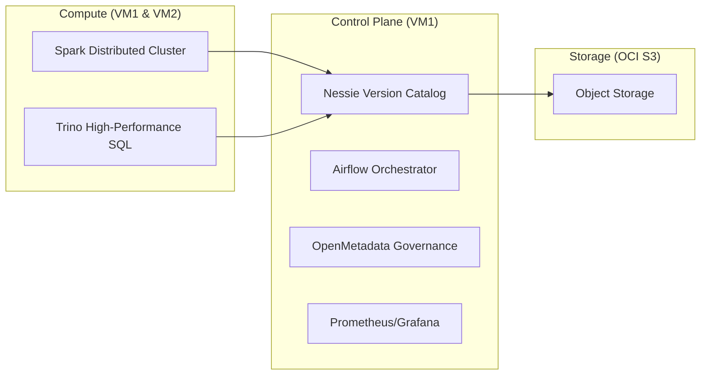

# 🏗️ Enterprise Lakehouse Architecture: The Full Stack

## 1. The Multi-Layer Medallion Vision

Our architecture evolves from raw ingestion to predictive intelligence across 4 distinct layers:

```
┌───────────────┐     ┌───────────────┐     ┌───────────────┐     ┌───────────────┐
│    BRONZE     │ ──► │    SILVER     │ ──► │     GOLD      │ ──► │   PLATINUM    │
│  (Raw Events) │     │  (Validated)  │     │ (Aggregates)  │     │ (ML Insights) │
└───────────────┘     └───────────────┘     └───────────────┘     └───────────────┘
    3.1M Rows             3.1M Rows            8 KPI Tables        120K Predictions
```

| Layer | Purpose | Key Tables |
|-------|---------|------------|
| **Bronze** | Raw land of OCI Parquet files | `orders_bronze` |
| **Silver** | Type-casting, deduplication, DQ scoring | `orders_silver` |
| **Gold** | Business metrics (Sales, Brands, Categories) | `daily_sales_gold`, `brand_performance_gold` |
| **Platinum** | **Machine Learning Tier** | `churn_predictions_ml`, `clv_predictions_ml` |

---

## 2. Infrastructure: Distributed & Decoupled

The system is distributed across 3 VMs and orchestrated via Docker, ensuring no single point of failure and high compute scalability.



---

## 3. The 4-Day Enhancement Stack

We've supercharged the base Lakehouse with enterprise-grade tools:

### 🚀 Performance: Trino v451
*   **Role**: Distributed SQL engine.
*   **Why**: Native Iceberg support allows joining 10+ tables with sub-second latency, bypassing Spark's overhead for BI.

### 📊 Visualization: Apache Superset
*   **Role**: BI Dashboarding.
*   **Why**: Decoupled from Spark, allowing hundreds of concurrent users to explore ML insights without slowing down data processing.

### 🛡️ Governance: OpenMetadata
*   **Role**: Data Discovery & Lineage.
*   **Why**: Provides a "Map" of our Lakehouse. Stakeholders can see exactly how a Churn prediction was derived from a raw Bronze event.

### 📈 Observability: Prometheus & Grafana
*   **Role**: Infrastructure Monitoring.
*   **Why**: Real-time alerts on CPU/RAM/Disk to ensure the nightly 3.1M record pipeline never fails silently.

---

## 4. Git-Like Version Control (Nessie)

Every layer development happens in isolation:
1.  **Branch**: `gold` branch created for testing a new aggregate algorithm.
2.  **Verify**: Validate data quality on the branch.
3.  **Merge**: Atomic merge to `main` ensures zero downtime for BI users.

---

## 5. Why This Architecture?

*   **Scalability**: Processes 3.1 million records on a distributed Spark cluster.
*   **Integrity**: Git-BRANCHing prevents "bad data" from ever reaching the dashboard.
*   **Intelligence**: Platinum layer provides **Prescriptive Analytics** (Churn, CLV).
*   **Trust**: Full end-to-end lineage via OpenMetadata.

---

> "We've built more than a pipeline; we've built a **Data Product** that is safe to evolve, easy to monitor, and smart enough to predict the future."
