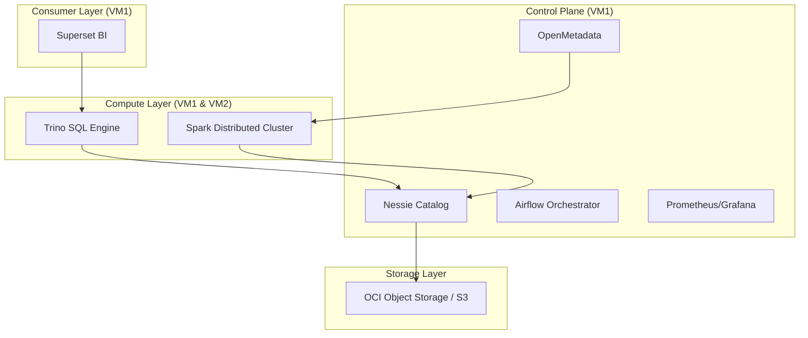

# 🎯 Lakehouse 360: Grand Finale Project Guide

## Project Title: **Enterprise Lakehouse with Git-Like Version Control & ML Intelligence**

**Duration:** 15-20 minutes  
**Tech Stack:** Iceberg, Nessie, Spark, Trino, Superset, Prometheus, Grafana, OpenMetadata  
**Data Volume:** 3.1M Transactions | 13M Events | 1.6M Unique Users  

---

## 🏗️ The Full Architecture (End-to-End)

**Show:** `ARCHITECTURE_EXPLAINED.md`

---

## 🎬 Presentation Flow

### **1. [0-3 min] Version Control & Medallion Pipeline**
*   **Show:** Airflow UI (`http://140.238.224.207:8080`)
*   **Show:** Nessie Branches (`LIST REFERENCES`)
*   **Narrative:** "We don't just process data; we version it. Using Nessie and Iceberg, we have a Medallion architecture (Bronze → Silver → Gold) where every transformation is a commit on a branch. We can branch for experimental ML and merge to main once verified."

### **2. [3-7 min] Platinum Layer: Machine Learning Intelligence**
*   **Show:** `PLATINUM_LAYER_EXPLAINED.md`
*   **Narrative:** "The **Gold Layer** gave us facts. The **Platinum Layer** gives us future predictions. We've implemented three advanced SparkML models:"
    *   **Customer Segmentation**: Identifying high-value VIPs.
    *   **Churn Prediction**: Detecting customers at risk of leaving.
    *   **CLV Prediction**: Forecasting revenue for the next 12 months.

### **3. [7-12 min] Grand Finale: The BI Dashboard**
*   **Show:** Superset UI (`http://140.238.224.207:8088`)
*   **The "Wow" Factor:**
    *   **Churn vs Value Heatmap**: Instantly visualize how many "Platinum" users are at "High Risk".
    *   **Smart Cross-Sell Table**: Recommendations generated by ML (e.g., Apple iPhone users bought AirPods).
    *   **Data Quality Board**: Shows the distribution of `data_quality_score` from our Silver layer validation.
*   **Tech Highlight:** "This is powered by **Trino v451**, allowing us to join 10+ Iceberg tables in seconds without touching the raw storage."

### **4. [12-15 min] Governance & Monitoring**
*   **Show:** OpenMetadata UI (`http://140.238.224.207:8585`)
    *   **Lineage**: See data flow from `orders_bronze` ➡️ `orders_silver` ➡️ `customer_segments_ml`.
*   **Show:** Grafana Dashboards (`http://140.238.224.207:3000`)
    *   **System Health**: Monitoring CPU/RAM across our cluster to ensure pipeline stability.

---

## 🏆 Final Summary: Why this wins
1.  **Safety**: Git-like branch/merge/time-travel prevents production data disasters.
2.  **Intelligence**: ML isn't just a separate experiment; it's a integrated layer of our Lakehouse.
3.  **Speed**: Decoupled Trino/Superset allows users to query millions of rows in real-time.
4.  **Trust**: OpenMetadata provides full lineage and observability.

---

## 📋 Presentation Checklist

- [ ] **Firewall**: Ensure Ports 8088, 8090, 8585, 3000 are open.
- [ ] **Login**: Admin/Admin ready for all services.
- [ ] **Tabs**: Pre-open Airflow, Superset, OpenMetadata, and Grafana.
- [ ] **Query**: Have the `Customer Persona View` SQL ready in Superset SQL Lab to show the "Raw to Rich" transformation.

---

**You are now presenting a state-of-the-art Lakehouse. Good luck! 🚀**
