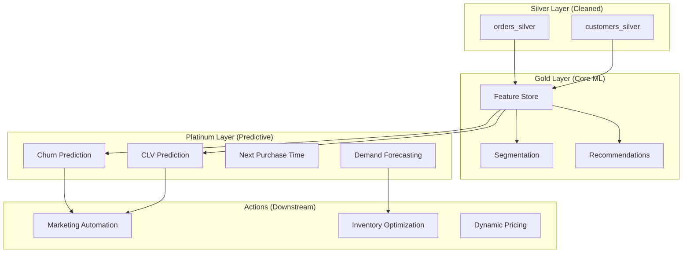

# 🚀 ML Future Roadmap: From Gold to Platinum

This document outlines the expansion plan for the Machine Learning layer of the E-commerce Data Lakehouse. Building upon the foundational Gold layer (Segmentation & Recommendations), we move towards predictive and prescriptive analytics.

## 🏗️ The "Platinum Layer" Architecture

The Platinum layer transforms business insights into automated actions.

---

## 🎯 Model Prioritization & Technical Breakdown

### Phase 1: High ROI / Low Effort (P0)
*Leverages existing RFM and Segment data.*

#### 1. Churn Prediction (The Retention Engine)
* **Goal:** Predict customers likely to stop purchasing.
* **Algorithm:** XGBoost / Logistic Regression.
* **Why now:** We already have recency and frequency trends; adding a binary target (active vs inactive) is straightforward.

#### 2. Customer Lifetime Value (The Value Engine)
* **Goal:** Forecast revenue for the next 12 months.
* **Algorithm:** XGBoost Regression.
* **Why now:** Uses similar features to Segmentation (Monetary + Tenure).

### Phase 2: Revenue Optimization (P1)
*Requires more granular time-series and browsing data.*

#### 3. Propensity to Buy
* **Goal:** Score customers on likelihood to buy specific categories.
* **Use Case:** Personalized email triggers (abandoned cart vs high-intent browsing).

#### 4. Next Purchase Time
* **Goal:** Optimize marketing touchpoint frequency.

### Phase 3: Operational Excellence (P2)
*High complexity, requires sophisticated time-series handling.*

#### 5. Demand Forecasting
* **Goal:** Product-level inventory planning.
* **Tech:** FBProphet or Spark ML (Linear Regression with seasonal components).

#### 6. Price Elasticity
* **Goal:** Revenue maximization via dynamic pricing.

---

## 🛠️ Implementation Strategy

1. **Integrated Feature Store:** Create a `customer_features` table in the Gold layer that aggregates all behavioral signals into a single "flattened" view, refreshed daily.
2. **WAP Deployment for Models:** Use the **Write-Audit-Publish (WAP)** pattern on Nessie to validate model output (e.g., check for probability skew or nulls) before merging to the main production branch.
3. **Partitioned Inference:** Since we have 13M customers, inference should be run as a distributed Spark job, writing to Iceberg tables partitioned by `prediction_date`.

---

## 📈 Success Metrics

| Initiative | Primary KPI | Target Impact |
|------------|-------------|---------------|
| Churn Focus | Retention Rate | +15% YoY |
| CLV Focus | Return on Ad Spend (ROAS) | +20% |
| Demand Focus | Stockout Rate | -30% |
| Recommendation | Cross-sell Revenue | +10% |

---

*Last Updated: 2026-01-28*
